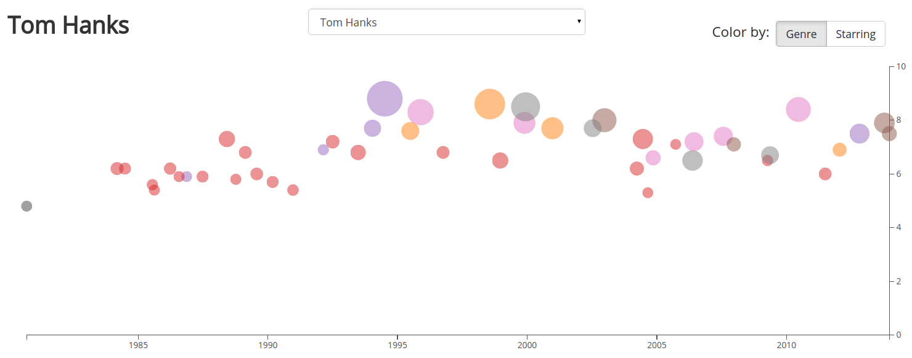
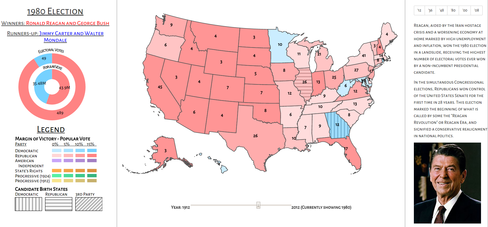
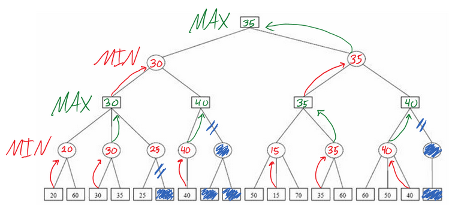
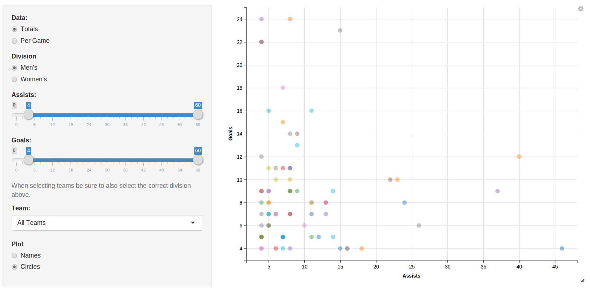
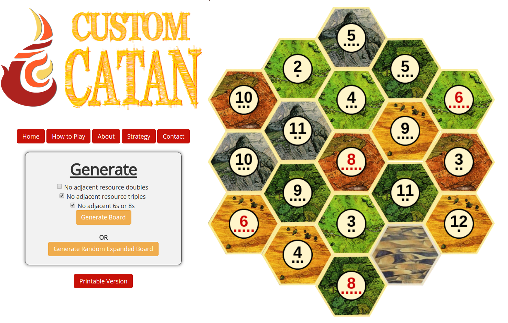
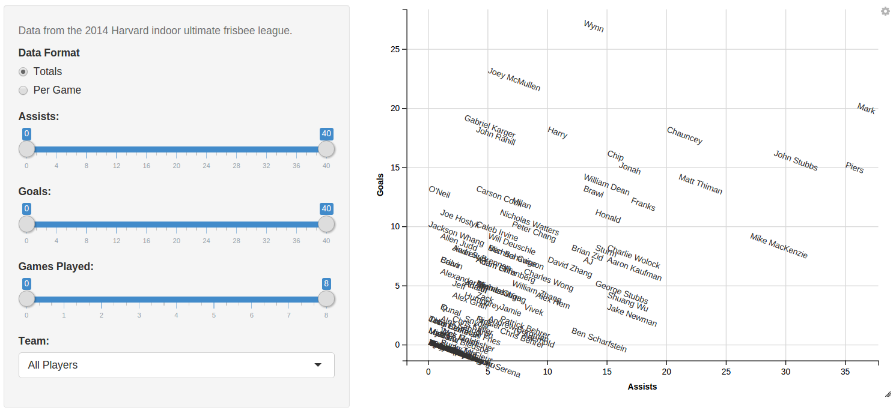

<!-- 
.. title: Projects
.. slug: projects
.. date: 2015-06-13 01:11:39 UTC-04:00
.. tags: 
.. category: 
.. link: 
.. description: 
.. type: text
-->

## Plotting Actor's Careers
  
**Category:** *Data Visualization, Web Scraping*  
**Made With:** *JavaScript, D3.js, Python*  
**See Code:** [GitHub](https://github.com/ryandkerr/actor-vis)

A condensed look at all of the movies an actor or actress has been in.

------------

## American Electoral Politics - The Past 100 Years
  
**Category:** *Data Visualization*  
**Made With:** *JavaScript, D3.js*  
**See Code:** [GitHub](https://github.com/ryandkerr/cs171-final)

An interactive choropleth + other visualizations to view American electoral politics from the past century.

------------

## Rondo - Connect Four AI using Minimax

**Category:** *Algorithms*  
**Made With:** *Python*  
**See Code:** [GitHub](https://github.com/ryandkerr/cs51-final)

An artificial-intelligence connect four opponent, affectionately nicknamed Rondo, implemented with the minimax algorithm.

------------

## Stat Leaders - 2015 College Ultimate Frisbee Nationals
  
**Category:** *Data Visualization, Web Scraping*  
**Made With:** *R, Shiny, Python*  
**See Code:** [GitHub](https://github.com/ryandkerr/nationals15)

A web-scraping and data visualization project looking at all of the players and teams during the 2015 College Ultimate Frisbee Nationals.

------------

## Custom Catan
  
**Category:** *Web Apps, Algorithms*  
**Made With:** *JavaScript, PHP*  

A web app that generates random Settlers of Catan boards, allowing the user to choose custom balance settings. 

------------

## Harvard Indoor Ultimate League
  
**Category:** *Data Visualization*  
**Made With:** *R, Shiny*  
**See Code:** [GitHub](https://github.com/ryandkerr/shiny-indoor14)

A data visualization of the players and teams in the Harvard 2014 winter indoor ultimate frisbee league.

